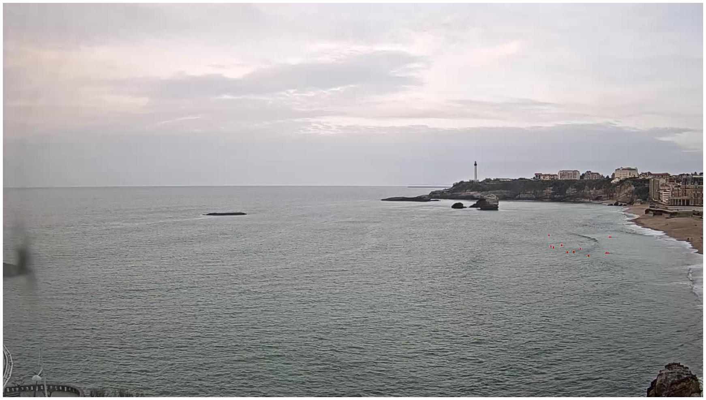
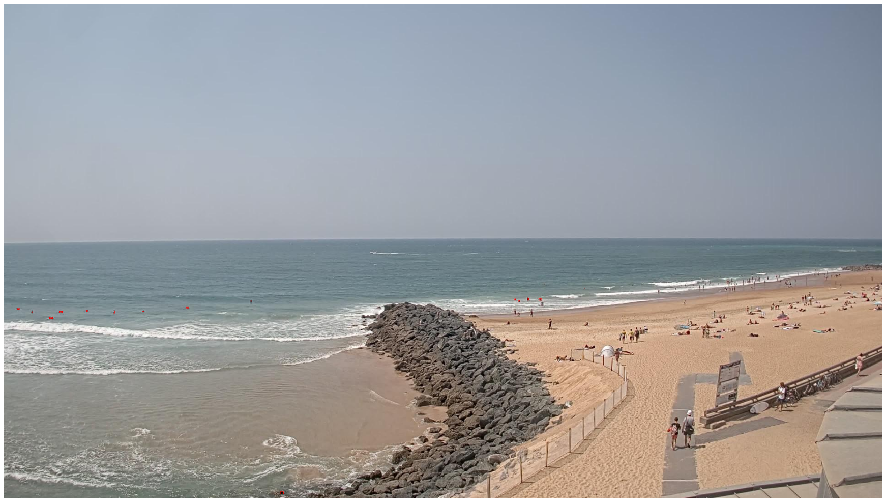
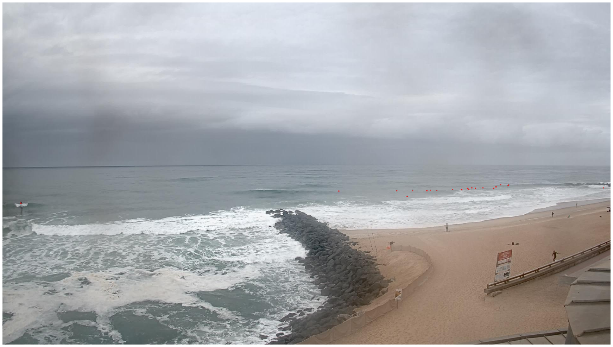

# Surf-Crowd

 Use images from beach-webcams to measure the crowdedness of surf spots and deliver insights.

## Surfers detection

Use object detection algorithms to detect bounding boxes of surfers in the water. 
Example of predictions on val set:

## Crowdedness prediction

Use evolution of surfers count, meteo data, temporal features, and surf condition forecast to predict crowdedness of surf spots.

JTBD

## Spot analysis 

Analysis of surfers density, spatial repartition.

JTBD